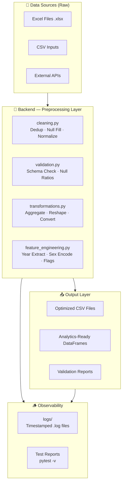
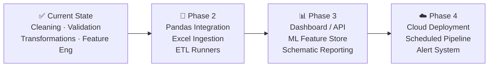

# 🏥 Healthcare Analytics Platform — Master Architecture & Program Flow
**Capstone Project DAMO-6994**
*Authored as: Master Data Architect (DA)*
*Last Updated: 2026-07-28*

---

## 1. Executive Summary

This document describes the **end-to-end system architecture, data pipeline design, and program flow** for the Healthcare Analytics Platform — a production-grade ETL and analytics framework for transforming raw healthcare datasets into structured, validated, analysis-ready outputs.

The platform is organized as a **modular Python backend**, with clearly separated concerns across ingestion, preprocessing, validation, feature engineering, and output stages.

---

## 2. System Architecture Overview



---

## 3. Module Responsibilities (Data Contract)

### 3.1 `cleaning.py` — Data Cleansing

| Function | Input | Output | Responsibility |
|---|---|---|---|
| `remove_duplicates(records)` | `List[Dict]` | `List[Dict]` | Deduplicates by hashed key-value representation; preserves insertion order |
| `clean_missing_values(records, fill_value)` | `List[Dict]`, `Any` | `List[Dict]` | Replaces `None`, `""`, `"null"`, `"nan"`, `"none"` with configurable fill value |

**Design Decision**: Uses `tuple(sorted(...))` hashing to avoid Pandas dependency at the cleaning stage — keeps the module lightweight and independently testable.

---

### 3.2 `validation.py` — Schema & Quality Gating

| Function | Input | Output | Responsibility |
|---|---|---|---|
| `validate_schema(records, required_columns)` | `List[Dict]`, `List[str]` | `Dict[str, Any]` | Checks column presence; returns validity flag, missing columns, row count |
| `calculate_null_ratios(records)` | `List[Dict]` | `Dict[str, float]` | Computes per-column missing-value percentage (rounded to 2 decimal places) |

**Design Decision**: Schema validation uses only the first row's keys — O(1) lookup — which is safe given that all records in a batch share the same schema.

---

### 3.3 `transformations.py` — Reshaping & Aggregation

| Function | Input | Output | Responsibility |
|---|---|---|---|
| `aggregate_by_group(records, group_col, val_col)` | `List[Dict]`, `str`, `str` | `Dict[str, float]` | Sums numeric values grouped by a categorical key; invalid values coerced to 0.0 |

**Design Decision**: Missing group keys fallback to `"Unknown"` to prevent silent data loss; missing value columns default to `0.0` to maintain aggregation integrity.

---

### 3.4 `feature_engineering.py` — Derived Features

| Function | Input | Output | Responsibility |
|---|---|---|---|
| `extract_year_from_period(period_str)` | `str` | `str` | Extracts 4-digit year via regex (`\b\d{4}\b`) from fiscal/calendar period strings |
| `encode_sex_category(sex_str)` | `str` | `str` | Normalizes free-text sex fields to `Male` / `Female` / `Other/Unknown` |

> [!IMPORTANT]
> **Bug Fixed (2026-07-28):** The original `extract_year_from_period` stripped all digits and took the first 4, causing `"Q1 2021"` → `"1202"`. Fixed to use `re.search(r"\b(\d{4})\b", ...)` for correct year extraction.

---

## 4. Program Flow — Preprocessing Pipeline

```
┌─────────────────────────────────────────────────────────────────┐
│                     RAW DATASET INPUT                           │
│           (Excel / CSV / API / In-memory records)               │
└────────────────────────────┬────────────────────────────────────┘
                             │
                             ▼
┌─────────────────────────────────────────────────────────────────┐
│  STAGE 1 — SCHEMA VALIDATION (validation.py)                    │
│  • validate_schema() → check required columns present           │
│  • calculate_null_ratios() → baseline quality metrics           │
│  • Gate: if valid=False → raise / log → abort pipeline          │
└────────────────────────────┬────────────────────────────────────┘
                             │  ✅ Valid
                             ▼
┌─────────────────────────────────────────────────────────────────┐
│  STAGE 2 — DEDUPLICATION (cleaning.py)                          │
│  • remove_duplicates() → collapse exact duplicate records       │
│  • Log count before vs after                                    │
└────────────────────────────┬────────────────────────────────────┘
                             │
                             ▼
┌─────────────────────────────────────────────────────────────────┐
│  STAGE 3 — NULL IMPUTATION (cleaning.py)                        │
│  • clean_missing_values() → fill None/empty/nan/null → "N/A"   │
│  • Configurable fill_value per dataset type                     │
└────────────────────────────┬────────────────────────────────────┘
                             │
                             ▼
┌─────────────────────────────────────────────────────────────────┐
│  STAGE 4 — FEATURE ENGINEERING (feature_engineering.py)         │
│  • extract_year_from_period() → derive fiscal year column       │
│  • encode_sex_category() → standardize demographic fields       │
│  • Additional: age binning, triage flags (extensible)           │
└────────────────────────────┬────────────────────────────────────┘
                             │
                             ▼
┌─────────────────────────────────────────────────────────────────┐
│  STAGE 5 — AGGREGATION & TRANSFORMATION (transformations.py)    │
│  • aggregate_by_group() → rollup by department, region, etc.   │
│  • reshape / rename / type cast as needed                       │
└────────────────────────────┬────────────────────────────────────┘
                             │
                             ▼
┌─────────────────────────────────────────────────────────────────┐
│  STAGE 6 — POST-PROCESSING VALIDATION (validation.py)           │
│  • Re-run validate_schema() on output dataset                   │
│  • calculate_null_ratios() → confirm no quality regression      │
└────────────────────────────┬────────────────────────────────────┘
                             │  ✅ Quality Gate Passed
                             ▼
┌─────────────────────────────────────────────────────────────────┐
│                   OPTIMIZED OUTPUT                               │
│        Validated CSV / DataFrame / Report                        │
└─────────────────────────────────────────────────────────────────┘
```

---

## 5. Project Structure

```
Capstone_Project-DAMO-6994-/
│
├── backend/
│   └── preprocessing/
│       ├── __init__.py              # Package init
│       ├── cleaning.py              # Dedup + null imputation
│       ├── feature_engineering.py   # Year extraction + sex encoding (bug fixed)
│       ├── transformations.py       # Aggregation + reshaping
│       └── validation.py            # Schema + null ratio checks
│
├── tests/
│   ├── __init__.py
│   ├── conftest.py                  # pytest configuration
│   └── test_preprocessing.py        # 61 unit + integration tests
│
├── logs/                            # 🪵 Auto-created log directory
│   ├── .gitkeep                     # Keeps directory in git (logs excluded)
│   └── test_run_YYYYMMDD_HHMMSS.log # Per-run timestamped log files
│
├── .gitignore                       # Excludes logs, data, __pycache__, .venv
└── README.md
```

---

## 6. Test Architecture

### 6.1 Test Suite Coverage Map

| Module | Test Class | Test Count | Coverage Areas |
|---|---|---|---|
| `cleaning.py` | `TestRemoveDuplicates` | 8 | No-dup, exact dup, partial, empty, order, None |
| `cleaning.py` | `TestCleanMissingValues` | 10 | None, empty, nan, null, custom fill, mixed |
| `feature_engineering.py` | `TestExtractYearFromPeriod` | 8 | Fiscal, Q-format, empty, None, short, alphanum |
| `feature_engineering.py` | `TestEncodeSexCategory` | 10 | Full word, abbrev, numeric, unknown, whitespace |
| `transformations.py` | `TestAggregateByGroup` | 7 | Basic, empty, missing key, bad value, multi-group |
| `validation.py` | `TestValidateSchema` | 6 | All present, missing, empty, no-required, count |
| `validation.py` | `TestCalculateNullRatios` | 8 | 0%, 50%, 100%, empty string, N/A string, rounding |
| *(all)* | `TestIntegration` | 4 | Full pipeline, aggregation-after-clean, batch year |
| **Total** | | **61** | **All 4 modules · Edge cases · Integration** |

### 6.2 Test Execution

```bash
# Run all tests with verbose output
python -m pytest tests/ -v --tb=short

# Run with coverage report
python -m pytest tests/ --cov=backend/preprocessing --cov-report=term-missing

# Run a specific class
python -m pytest tests/test_preprocessing.py::TestIntegration -v
```

---

## 7. Logging Design

Every test run generates a timestamped log in `logs/`:

```
logs/test_run_20260728_202300.log
```

**Log format:**
```
2026-07-28 20:23:00,123 | INFO     | test_preprocessing | Test session started — log: logs/test_run_...
```

For application-level logging (when pipeline runs in production), add a `logger.py` utility:

```python
# Recommended pattern for pipeline logging
import logging
from pathlib import Path
from datetime import datetime

def get_pipeline_logger(name: str) -> logging.Logger:
    log_dir = Path("logs")
    log_dir.mkdir(exist_ok=True)
    log_file = log_dir / f"{name}_{datetime.now().strftime('%Y%m%d_%H%M%S')}.log"
    logger = logging.getLogger(name)
    logger.setLevel(logging.INFO)
    handler = logging.FileHandler(log_file, encoding="utf-8")
    handler.setFormatter(logging.Formatter("%(asctime)s | %(levelname)-8s | %(message)s"))
    logger.addHandler(handler)
    return logger
```

---

## 8. Data Architecture Principles (Master DA Notes)

> [!NOTE]
> These principles govern all data design decisions in this platform.

| Principle | Application |
|---|---|
| **Separation of Concerns** | Each module owns exactly one responsibility (clean, validate, transform, engineer) |
| **Fail-Fast Validation** | Schema validation gates the pipeline before any transformation is attempted |
| **Immutability** | All functions return new lists/dicts — input records are never mutated in-place |
| **Configurable Defaults** | Fill values, required columns, group keys are all parameterized — no hardcoding |
| **Graceful Degradation** | Missing keys / bad values → safe defaults (`"Unknown"`, `0.0`) rather than exceptions |
| **Observability First** | All pipeline stages log timestamps, record counts, and quality metrics to `logs/` |
| **Zero External Dependencies** | Core preprocessing uses only Python stdlib (`re`, `typing`) — pandas is not required |

---

## 9. Extension Roadmap



---

*Document maintained by the Data Architecture team — update on every significant module addition or pipeline change.*
