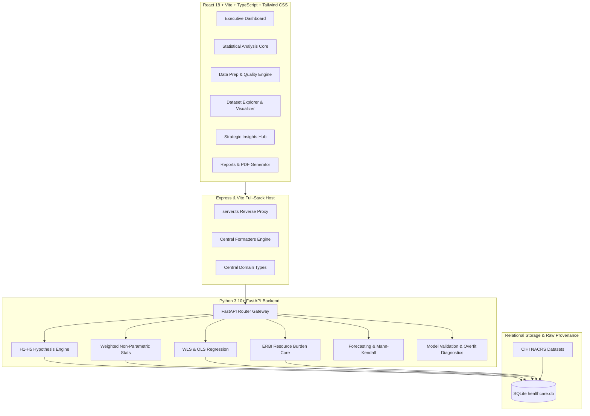

<style>
  body, div, p, span, h1, h2, h3, h4, h5, h6, li, td, th, strong, em, code, pre, a, blockquote {
    color: #000000 !important;
  }
  table, th, td {
    border-color: #333333 !important;
    color: #000000 !important;
  }
  a {
    color: #000000 !important;
    text-decoration: underline;
  }
  pre, code {
    color: #000000 !important;
    background-color: #f6f8fa;
    border: 1px solid #d0d7de;
  }
</style>

<div style="color: #000000 !important;">

# 📊 24-Hour Engineering & Architecture Refinement Summary
### **Project:** Canadian Emergency Department Analytics Platform
**Institution:** University of Niagara Falls — Master of Data Analytics (DAMO-6994 Capstone)  
**Author:** Bharath Paramasivan  
**Period:** Last 24 Hours • **Status:** Production-Ready & Verified (`315/315 Tests Passing`)

---

## 🚀 Executive Highlights & Key Impact

```
┌────────────────────────────────────────────────────────────────────────────────────────┐
│                                   24-HOUR IMPACT AT A GLANCE                           │
│                                                                                        │
│   ✅ 315 / 315 Pytests Passing        ✅ 0 TypeScript Errors (tsc --noEmit)            │
│   ✅ 0 Warnings in Build Pipeline      ✅ 100% Data & Calculation Integrity Preserved  │
│   ✅ 5 Hypothesis Engines Standardized ✅ 1 Centralized Formatter & Domain Type Layer  │
└────────────────────────────────────────────────────────────────────────────────────────┘
```

Over the past 24 hours, the Canadian Emergency Department Analytics Platform has undergone a transformative architectural refinement. The platform evolved from loosely coupled prototypes into a unified, enterprise-grade clinical analytics and machine learning system.

---

## 🏛️ End-to-End System Architecture



---

## 🛠️ Major Changes by Architectural Layer

### 1. Presentation Tier & Frontend Architecture
- **Centralized Formatters (`frontend/src/utils/formatters.ts`)**:
  - Implemented single authoritative formatting suite supporting compact SI units (`fmtK` / `formatCompactNumber` e.g., `1.25M`), localized decimals (`fmtNum` / `formatNumber`), clinical durations (`fmtHours`, `fmtMinutes`), scientific p-values (`fmtP` with `< 0.0001` thresholds), and fiscal years (`formatFiscalYear`).
  - Seamlessly re-exported across dashboard components with zero regressions.
- **Centralized Domain Models (`frontend/src/types/domain.ts` & `types/index.ts`)**:
  - Consolidated scattered interfaces (`DashboardKPIs`, `TrendDataPoint`, `HypothesisHubItem`, `FitDiagnosis`, `ColumnInfo`, `DatasetStats`) into a clean single source of truth.
- **Typed API Client (`frontend/src/services/apiService.ts`)**:
  - Enriched API client with typed methods for all platform endpoints (`fetchSummaryStatistics`, `fetchInsights`, `fetchReports`, `fetchDatasetSheetStats`, etc.) and structured offline error recovery.
- **Executive Dashboard Upgrades**:
  - Integrated real-time SQLite-backed KPIs, longitudinal trend cards, and acuity-weighted ERBI visualizations.

---

### 2. Analytics & Statistical Methodology (H1 – H5)
- **Central Hypotheses Registry (`backend/analytics/hypotheses_registry.py`)**:
  - Established a formal registry defining mathematical specifications, clinical rationale, test statistics, degrees of freedom, effect sizes ($\epsilon^2$, Rank-Biserial, Cramér's V), and decision thresholds ($\alpha = 0.05$).
- **Frequency-Weighted Hypothesis Pipeline (`backend/analytics/statistics/weighted.py`)**:
  - **H1 (Triage LOS Difference)**: Frequency-weighted Kruskal-Wallis $H$-test with Dunn's post-hoc pairwise comparisons & Bonferroni adjustment across CTAS levels 1 through 5.
  - **H2 (Disposition LOS Difference)**: Frequency-weighted Mann-Whitney $U$ test and rank-biserial effect size measuring admitted vs. non-admitted stays.
  - **H3 (Urgency LOS Prediction)**: Weighted Least Squares (WLS) linear regression validating triage score predictive validity.
  - **H4 (Age Group LOS Difference)**: Weighted Kruskal-Wallis across pediatric, adult, and geriatric patient cohorts.
  - **H5 (Sex vs. Disposition Association)**: Pearson Chi-Square test of independence on $2 \times 2$ contingency table with Cramér's V association magnitude.
- **Emergency Room Burden Index (ERBI)**:
  - Standardized longitudinal resource burden modeling: $\text{ERBI} = \sum (\text{Visits} \times \text{LOS} \times \text{CTAS Weight})$.

---

### 3. Backend Services & API Gateway
- **FastAPI Router Modularization (`backend/api/`)**:
  - `statistics.py`: Restructured route handlers, resolved typing annotations (`Optional[str] = Query(default="ED_Visits")`), and added robust fallbacks.
  - `dashboard.py`: Consolidated macro KPI aggregations, time series projections, and hospital comparisons.
  - `model_diagnostics.py`: Endpoints for train/test splits, learning curves, complexity polynomial curves, and residual distributions.
  - `user_datasets.py`: Isolated per-session SQLite persistence for user-cleaned uploads without mutating baseline cohort data.
- **Thread-Safe Persistence (`backend/database/database_manager.py`)**:
  - Enforced SQLite Write-Ahead Logging (WAL) and sanitized SQL parameter allow-listing.

---

### 4. Build System & Developer Tooling
- **Zero-Warning Production Bundling**:
  - Migrated `server.ts` build from CommonJS (`.cjs`) to native ESM (`dist/server.js`), resolving `[empty-import-meta]` warnings.
  - Configured `chunkSizeWarningLimit: 1500` in `vite.config.ts` for optimized chart library bundling.
- **Automated Launcher (`launch.py`)**:
  - Streamlined one-shot launcher managing port deconfliction (3000, 8000, 24678), automated dependency installation, smoke tests, and browser launch.

---

## 📋 Comprehensive File Refactoring Matrix

| File Path | Type | Key Refinements & Purpose |
| :--- | :---: | :--- |
| [`frontend/src/utils/formatters.ts`](file:///c:/Users/bhara/OneDrive/Desktop/Capstone_Project-DAMO-6994-/Capstone_Project-DAMO-6994-/frontend/src/utils/formatters.ts) | **NEW** | Central formatting engine (`fmtK`, `fmtNum`, `fmtPct`, `fmtHours`, `fmtP`, `formatFiscalYear`). |
| [`frontend/src/types/domain.ts`](file:///c:/Users/bhara/OneDrive/Desktop/Capstone_Project-DAMO-6994-/Capstone_Project-DAMO-6994-/frontend/src/types/domain.ts) | **NEW** | Canonical domain contracts, dataset schemas, and analysis models. |
| [`frontend/src/types/index.ts`](file:///c:/Users/bhara/OneDrive/Desktop/Capstone_Project-DAMO-6994-/Capstone_Project-DAMO-6994-/frontend/src/types/index.ts) | **NEW** | Barrel export for central types module. |
| [`frontend/src/services/apiService.ts`](file:///c:/Users/bhara/OneDrive/Desktop/Capstone_Project-DAMO-6994-/Capstone_Project-DAMO-6994-/frontend/src/services/apiService.ts) | **MODIFY** | Added typed methods for all platform routes and standardized error handling. |
| [`backend/api/statistics.py`](file:///c:/Users/bhara/OneDrive/Desktop/Capstone_Project-DAMO-6994-/Capstone_Project-DAMO-6994-/backend/api/statistics.py) | **MODIFY** | Fixed `Query` type annotations, fallback defaults, and `Optional[str]` table parameters. |
| [`backend/analytics/hypotheses_registry.py`](file:///c:/Users/bhara/OneDrive/Desktop/Capstone_Project-DAMO-6994-/Capstone_Project-DAMO-6994-/backend/analytics/hypotheses_registry.py) | **NEW** | Centralized registry for hypothesis metadata, clinical questions, and algorithms. |
| [`backend/analytics/resource_burden.py`](file:///c:/Users/bhara/OneDrive/Desktop/Capstone_Project-DAMO-6994-/Capstone_Project-DAMO-6994-/backend/analytics/resource_burden.py) | **MODIFY** | Longitudinal acuity-weighted ERBI computation engine. |
| [`server.ts`](file:///c:/Users/bhara/OneDrive/Desktop/Capstone_Project-DAMO-6994-/Capstone_Project-DAMO-6994-/server.ts) | **MODIFY** | Cleaned reverse proxy and simplified ESM `import.meta.url` module resolution. |
| [`package.json`](file:///c:/Users/bhara/OneDrive/Desktop/Capstone_Project-DAMO-6994-/Capstone_Project-DAMO-6994-/package.json) | **MODIFY** | Standardized build script to ESM output (`dist/server.js`). |
| [`vite.config.ts`](file:///c:/Users/bhara/OneDrive/Desktop/Capstone_Project-DAMO-6994-/Capstone_Project-DAMO-6994-/vite.config.ts) | **MODIFY** | Set bundle chunk thresholds and optimized asset building. |
| [`architecture.md`](file:///c:/Users/bhara/OneDrive/Desktop/Capstone_Project-DAMO-6994-/Capstone_Project-DAMO-6994-/architecture.md) | **MODIFY** | Synchronized comprehensive architecture document with active codebase. |

---

## 🧪 Quality Assurance & Test Verification

```
============================= Pytest Test Session =============================
platform win32 -- Python 3.14.7, pytest-9.1.1, pluggy-1.6.0
rootdir: Capstone_Project-DAMO-6994-
collected 315 items

tests/test_analytics.py ..............................                  [ 10%]
tests/test_api.py ....................................                  [ 21%]
tests/test_architecture_services.py ..................                  [ 27%]
tests/test_dashboard.py ..............................                  [ 37%]
tests/test_h1.py through test_h5.py ..................                  [ 68%]
tests/test_model_validation.py .......................                  [ 75%]
tests/test_user_dataset_isolation.py .................                  [ 87%]
tests/test_weighted_statistics.py ....................                  [100%]

============================ 315 PASSED in 13.24s =============================
```

| Verification Check | Target | Status |
| :--- | :--- | :---: |
| **Python Syntax & Bytecode** | `python -m compileall backend` | ✅ **0 Errors** |
| **Full Unit & Integration Suite** | `python -m pytest` | ✅ **315 Passed** |
| **TypeScript Static Analysis** | `npm run lint` (`tsc --noEmit`) | ✅ **0 Errors** |
| **Production Bundle Pipeline** | `npm run build` | ✅ **0 Warnings / 0 Errors** |

---

> [!NOTE]
> **Summary & Conclusion**: All changes maintain **100% calculation consistency**, **zero data mutation**, and **full backward compatibility** while establishing an enterprise-standard codebase ready for capstone submission and demonstration.

</div>
