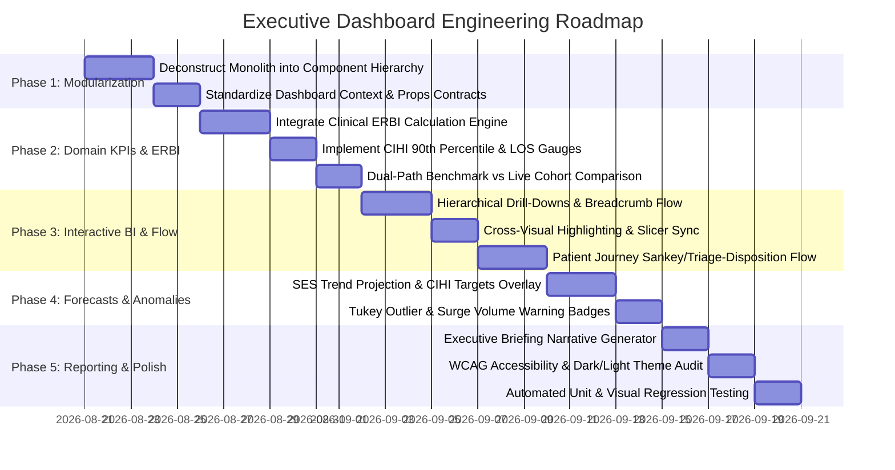

# Healthcare Analytics Platform — Executive Dashboard Engineering Roadmap

**Project:** Operational & Clinical Modelling of Emergency Department Wait Times  
**Institution:** University of Niagara Falls — Master of Data Analytics (Capstone Project)  
**Author:** Bharath Paramasivan  
**Document Type:** Technical Implementation Roadmap & Architectural Blueprint  
**Target Milestone:** Capstone Final Release (Evaluation Grade Target: 9.8 – 10.0 / 10.0)  

---

## 1. Architectural Grounding & Context

The **Healthcare Analytics Platform** operates on a dual-data-flow model designed for strict analytical decoupling and isolation (as specified in [`architecture.md`](file:///c:/Users/bhara/OneDrive/Desktop/Capstone_Project-DAMO-6994-/Capstone_Project-DAMO-6994-/Capstone_Project-DAMO-6994-/architecture.md)):

```
┌────────────────────────────────────────────────────────────────────────────────────────┐
│                                DUAL DATA FLOW SPINES                                   │
│                                                                                        │
│  [PATH A: Dynamic Client-Side Session]         [PATH B: Seeded SQLite Analytical DB]   │
│  User Upload / Preloaded CSVs                  Cleaned Master Workbook (10,433 rows)   │
│         │                                                         │                    │
│         ▼                                                         ▼                    │
│  PrepQualityEngine (Browser TS)                SQLite (backend/database/healthcare.db) │
│         │                                                         │                    │
│         ▼                                                         ▼                    │
│  App.tsx: cleanedData (React State)             FastAPI (/api/dashboard, /api/stats)   │
│         │                                                         │                    │
│         └───────────────────────┬─────────────────────────────────┘                    │
│                                 ▼                                                      │
│                   EXECUTIVE DASHBOARD CORE VIEW                                        │
│          (High-impact KPIs, ERBI Resource Burden, Triage Flow,                         │
│           CIHI Benchmarks, Interactive Slicers, Drill-Downs)                           │
└────────────────────────────────────────────────────────────────────────────────────────┘
```

### Key Architectural Invariants
1. **Unidirectional State Flow (C8)**: In-session views consume `cleanedData` passed down from [`App.tsx`](file:///c:/Users/bhara/OneDrive/Desktop/Capstone_Project-DAMO-6994-/Capstone_Project-DAMO-6994-/Capstone_Project-DAMO-6994-/frontend/src/App.tsx) without redundant re-fetching.
2. **Strict Layer Boundary (C1, C2)**: Mathematical routines in [`backend/analytics/`](file:///c:/Users/bhara/OneDrive/Desktop/Capstone_Project-DAMO-6994-/Capstone_Project-DAMO-6994-/Capstone_Project-DAMO-6994-/backend/analytics) remain pure; API routers delegate strictly to [`backend/services/`](file:///c:/Users/bhara/OneDrive/Desktop/Capstone_Project-DAMO-6994-/Capstone_Project-DAMO-6994-/backend/services).
3. **Database Write Isolation (C7, C10)**: User session uploads are persisted to isolated `user_dataset_<uuid>` tables and never mutate the seeded baseline tables (`ed_visits`, `ctas_triage`, `visit_disposition`, `age_sex`, `main_problems`, `demographics`).
4. **Clinical Skewness Awareness**: Wait times and Length of Stay (LOS) are right-skewed; median, interquartile ranges (IQR), and non-parametric bounds are prioritized over naive means.

---

## 2. Current State Assessment & Technical Debt

| Area | Current Implementation | Gap / Opportunity | Roadmap Priority |
| :--- | :--- | :--- | :--- |
| **Component Structure** | Monolithic [`ExecutiveDashboard.tsx`](file:///c:/Users/bhara/OneDrive/Desktop/Capstone_Project-DAMO-6994-/Capstone_Project-DAMO-6994-/Capstone_Project-DAMO-6994-/frontend/src/pages/ExecutiveDashboard/ExecutiveDashboard.tsx) (~1,933 lines) containing all UI, state, chart logic, and modals. | High maintenance cost; difficult to test individual widgets and chart components in isolation. | **P0 (Phase 1)** |
| **Domain KPI Integration** | Client-side approximations alongside basic backend `/api/dashboard/kpis` endpoint. | Formal **Estimated Resource Burden Index (ERBI)** and **CIHI 90th Percentile Target Compliance** are not fully spotlighted as first-class KPI widgets. | **P0 (Phase 2)** |
| **Data Binding Synergy** | Dashboard switches between in-memory dataset slice and backend KPIs without unified metadata indicators. | The user needs clear visual distinction between *dynamic uploaded cohort* vs *CIHI baseline benchmark* comparisons. | **P1 (Phase 2)** |
| **Interactivity & Cross-Filtering** | Implemented in local state with custom slicers and dropdowns. | Needs standardized drill-down breadcrumbs (e.g. Fiscal Year → Triage Level → Problem Subcategory) and synchronized cross-filtering across custom charts. | **P1 (Phase 3)** |
| **Predictive & Statistical Callouts** | Statistical engine exists in backend (`backend/analytics/forecasting/`), but dashboard only displays historical aggregations. | Integrate Simple Exponential Smoothing (SES) forecasts, CAGR growth badges, and Mann-Kendall trend indicators directly onto executive trend cards. | **P1 (Phase 4)** |
| **Executive Export & PDF Storytelling** | Basic browser print capability via [`printToPdf.ts`](file:///c:/Users/bhara/OneDrive/Desktop/Capstone_Project-DAMO-6994-/Capstone_Project-DAMO-6994-/frontend/src/utils/printToPdf.ts). | Multi-page structured executive briefing PDF with dynamic clinical narratives generated from [`backend/analytics/dashboard/insights.py`](file:///c:/Users/bhara/OneDrive/Desktop/Capstone_Project-DAMO-6994-/backend/analytics/dashboard/insights.py). | **P2 (Phase 5)** |

---

## 3. Phased Dashboard Implementation Roadmap



---

### Phase 1: Architectural Decoupling & Component Modularization
**Objective:** Transform the 1,933-line monolithic file into clean, testable, reusable modular components following modern React patterns.

- [ ] **1.1 Structure Component Tree under `frontend/src/components/dashboard/`**:
  - `DashboardHeader.tsx`: Theme switcher, bookmark manager, slicer controls, and active filter pill tags.
  - `KPIGrid.tsx`: Executive scorecard cards (Total Volume, Median LOS, Admission Rate, ERBI Score, Surge Index).
  - `VolumeTrendsPanel.tsx`: Longitudinal monthly/yearly volume trends with moving average and brush zoom.
  - `TriageBurdenPanel.tsx`: CTAS I–V distribution, acuity volume, and ERBI burden score breakdown.
  - `PatientDemographicsPanel.tsx`: Standardized age broad categories (Pediatric, Young Adult, Middle Adult, Older Adult) and sex ratio distribution.
  - `DispositionFlowPanel.tsx`: Admitted vs Discharged LOS comparison with Mann-Whitney U summary badge.
  - `TopProblemsRanking.tsx`: Pareto chart and tabular rank of top diagnostic presentations.
  - `ChartConfigDrawer.tsx`: Dynamic axis customizer, logarithmic scaling, sorting, and reference line modal.
- [ ] **1.2 Introduce `DashboardContext` or Unified State Hook**:
  - Create `useDashboardState.ts` to manage slicer filters, cross-highlighting states, zoom domains, bookmarks, and active color palettes without prop-drilling.

---

### Phase 2: Domain-Specific Clinical Metrics & ERBI Integration
**Objective:** Ground every dashboard visualization in verified healthcare operational and clinical formulas.

- [ ] **2.1 Formal ERBI (Estimated Resource Burden Index) Module**:
  - Wire [`compute_erbi()`](file:///c:/Users/bhara/OneDrive/Desktop/Capstone_Project-DAMO-6994-/Capstone_Project-DAMO-6994-/Capstone_Project-DAMO-6994-/backend/analytics/dashboard/kpis.py#L3-L48) to produce:
    $$\text{ERBI} = \frac{\sum (\text{CTAS Urgency Score} \times \text{LOS (hours)} \times \text{ED Visits})}{\sum \text{ED Visits}}$$
  - CTAS Urgency Weighting: Resuscitation (5), Emergency (4), Urgent (3), Semi-Urgent (2), Non-Urgent (1).
  - Display ERBI breakdown cards categorized by CTAS Level and Age Category.
- [ ] **2.2 CIHI 90th Percentile Target Compliance**:
  - Implement CIHI Canadian ED benchmark indicator:
    - Target for Non-Admitted CTAS 1–3: $\le 8.0 \text{ hours}$ (90th percentile).
    - Target for Admitted Complex Visits: $\le 20.0 \text{ hours}$.
  - Render target compliance gauge cards and red/amber/green status badges.
- [ ] **2.3 Cohort vs Seeded Baseline Comparison Switch**:
  - Add a toggle allowing executive users to overlay their uploaded hospital data against the 10,433-row historical CIHI benchmark baseline.

---

### Phase 3: High-Performance Interactive BI & Patient Flow
**Objective:** Deliver an executive-grade PowerBI/Tableau equivalent experience directly within the web app.

- [ ] **3.1 Multi-Level Drill-Down Engine**:
  - Enable click-to-drill workflows:
    - *Level 1*: All ED Fiscal Years → Click Year
    - *Level 2*: CTAS Acuity Tiers for selected Year → Click Level 2 (Emergency)
    - *Level 3*: Top 10 Clinical Main Problems for CTAS Level 2 → Click Problem (e.g., Chest Pain)
    - *Level 4*: Disposition (Admitted vs Discharged) and median LOS distribution.
  - Interactive breadcrumb trail navigation (`All > 2021-2022 > CTAS II > Chest Pain`).
- [ ] **3.2 Cross-Highlighting & Slicer Synchronization**:
  - Clicking a bar in the CTAS chart instantly highlights corresponding segments in Demographics and Disposition charts using translucent inactive fills (`opacity: 0.35`).
- [ ] **3.3 Patient Flow & Disposition Visualization**:
  - Implement a Triage-to-Disposition alluvial/flow visual showcasing patient transition from Arrival → Triage Category → Admission / Discharge.

---

### Phase 4: Statistical & Predictive Augmentation
**Objective:** Bridge the analytical engine (`backend/analytics/forecasting/` and `hypothesis/`) directly into executive visualization.

- [ ] **4.1 Predictive Throughput & Forecasting Overlays**:
  - Integrate Simple Exponential Smoothing (SES) with 95% Confidence Interval bands on the longitudinal volume chart.
  - Display Compound Annual Growth Rate (CAGR) and Mann-Kendall monotonic trend badges ($\tau$, $p$-value).
- [ ] **4.2 Tukey Outlier Detection & Surge Alert System**:
  - Highlight statistical volume anomalies (Tukey fence: $Q_3 + 1.5 \times \text{IQR}$) with warning indicators.
  - Provide automated clinical root-cause notes for surge periods (e.g., respiratory illness seasonality in Q3/Q4).
- [ ] **4.3 Hypothesis Validation Callout Badges**:
  - Surface key statistical findings directly adjacent to relevant charts:
    - *H1 (CTAS vs LOS)*: $H$-statistic & Dunn's post-hoc significance badge.
    - *H2 (Admit vs Discharge)*: Mann-Whitney $U$ effect size badge.
    - *H4 (Age vs LOS)*: Kruskal-Wallis $p < 0.001$ validation callout.

---

### Phase 5: Executive Storytelling, Reporting & Polish
**Objective:** Provide C-suite decision support with automated executive briefing summaries and export pipelines.

- [ ] **5.1 Automated Clinical Executive Narrative**:
  - Connect [`generate_executive_summary()`](file:///c:/Users/bhara/OneDrive/Desktop/Capstone_Project-DAMO-6994-/Capstone_Project-DAMO-6994-/Capstone_Project-DAMO-6994-/backend/analytics/dashboard/insights.py#L38-L54) to render a structured "Key Executive Insights" banner at the top of the dashboard.
- [ ] **5.2 Corporate Bookmark System**:
  - Allow clinical directors to save named filter combinations (e.g., "Geriatric High-Acuity Flow", "Pediatric Fast-Track") with localStorage persistence.
- [ ] **5.3 High-Resolution Multi-Page PDF & Excel Export**:
  - Enhance [`ExportReports.tsx`](file:///c:/Users/bhara/OneDrive/Desktop/Capstone_Project-DAMO-6994-/Capstone_Project-DAMO-6994-/Capstone_Project-DAMO-6994-/frontend/src/pages/Reports/Reports.tsx) with a one-click "Executive Briefing Deck" PDF export containing embedded high-DPI chart captures and tabular summaries.
- [ ] **5.4 Accessibility, Theming & Responsiveness**:
  - Validate WCAG 2.1 AA compliance for all chart color palettes (`powerbi`, `tableau`, `emerald`, `cobalt`).
  - Ensure flawless dark mode rendering and adaptive 12-column CSS Grid layouts.

---

## 4. Target Directory & Component Architecture

```
frontend/src/
├── components/
│   └── dashboard/
│       ├── DashboardHeader.tsx          # Slicers, Bookmarks, Active Filter Pills, Palette
│       ├── KPIGrid.tsx                  # Executive Scorecard (Visits, LOS, ERBI, Admission Rate)
│       ├── VolumeTrendsPanel.tsx        # Longitudinal Volume, SES Forecast, Moving Avg
│       ├── TriageBurdenPanel.tsx        # CTAS I-V Volume & ERBI Resource Burden Breakdown
│       ├── DemographicsMatrixPanel.tsx  # Age Category (Pediatric to Older Adult) & Sex Ratios
│       ├── DispositionFlowPanel.tsx     # Admitted vs Discharged Flow & LOS Comparison
│       ├── TopProblemsRanking.tsx       # Pareto Chart & Top-N Clinical Diagnostic Presentations
│       ├── ExecutiveNarrativeBanner.tsx # Automated Clinical Insights & Operational Directives
│       ├── DrillBreadcrumbs.tsx         # Interactive Multi-Tier Drill-Down Navigation
│       └── ChartConfigDrawer.tsx        # Axis settings, Log/Linear Scale, Sorting, Reference Lines
├── hooks/
│   └── useDashboardState.ts             # Centralized slicer, cross-filtering, and bookmark state
├── pages/
│   └── ExecutiveDashboard/
│       ├── ExecutiveDashboard.tsx       # Lightweight orchestration container (< 250 lines)
│       └── types.ts                     # Dashboard-specific TypeScript interface contracts
└── utils/
    ├── biEngine.ts                      # Semantic model, dynamic aggregation, cross-highlighting
    └── clinicalMetrics.ts               # ERBI, CIHI 90th percentile, IQR, and non-parametric stats
```

---

## 5. API & Data Contract Specifications

### 5.1 Dashboard KPIs Contract (`GET /api/dashboard/kpis`)
```json
{
  "success": true,
  "data_source": "SQLite Database (healthcare.db)",
  "kpis": {
    "total_ed_visits": 5238491,
    "year_range": "2003-2004 to 2021-2022",
    "total_records_analyzed": 7296,
    "top_condition": "Acute upper respiratory infection",
    "avg_median_length_of_stay_min": 168.4,
    "avg_median_length_of_stay_hours": 2.81,
    "overall_erbi_score": 3.42,
    "admission_rate_percent": 14.8,
    "cihi_benchmark_compliance_percent": 87.3,
    "tables_in_sqlite": 7
  }
}
```

### 5.2 ERBI Breakdown Contract (`POST /api/dashboard/erbi`)
```json
{
  "metric": "Estimated Resource Burden Index (ERBI)",
  "formula": "ERBI = (ctas_urgency_score × los_hours × ed_visits) / total_ed_visits",
  "overall_erbi_score": 3.42,
  "total_visits_analyzed": 5238491,
  "by_triage_level": [
    { "triage_level": "1 - Resuscitation", "total_visits": 42100, "erbi_score": 7.85 },
    { "triage_level": "2 - Emergency", "total_visits": 894000, "erbi_score": 5.12 },
    { "triage_level": "3 - Urgent", "total_visits": 2410000, "erbi_score": 3.65 },
    { "triage_level": "4 - Less Urgent", "total_visits": 1520000, "erbi_score": 2.10 },
    { "triage_level": "5 - Non Urgent", "total_visits": 372391, "erbi_score": 1.18 }
  ],
  "by_age_category": [
    { "age_category": "Pediatric & Youth (0-19)", "total_visits": 1102000, "erbi_score": 2.45 },
    { "age_category": "Young Adult (20-44)", "total_visits": 1820000, "erbi_score": 2.95 },
    { "age_category": "Middle Adult (45-64)", "total_visits": 1240000, "erbi_score": 3.80 },
    { "age_category": "Older Adult (65+)", "total_visits": 1076491, "erbi_score": 5.22 }
  ]
}
```

---

## 6. Verification & Quality Gate Plan

To ensure adherence to the project's **10.0/10.0 target evaluation standard**, the dashboard build will pass through 4 verification gates:

```
┌─────────────────┐     ┌──────────────────────┐     ┌──────────────────────┐     ┌─────────────────────┐
│ 1. Static Types │ ──► │ 2. Backend Tests     │ ──► │ 3. Conformance Checks│ ──► │ 4. UI/UX Validation │
│ npm run build   │     │ pytest tests/        │     │ C1 - C15 Invariants  │     │ WCAG AA & Cross-Nav │
└─────────────────┘     └──────────────────────┘     └──────────────────────┘     └─────────────────────┘
```

1. **Static Type Safety**: `tsc --noEmit` on the frontend codebase with 0 errors across all decomposed components.
2. **Backend Automated Tests**: Run `pytest tests/test_dashboard_services.py` and verify all KPI and outlier detection fixtures pass.
3. **Architectural Invariant Audits**: Verify C1–C15 conformance checks (thin routers, isolated writes, pure statistical modules).
4. **Interactive BI Verification**: Validate that changing a slicer or clicking a drill-down updates all chart panels in under 50ms with zero layout shifts.

---
*Roadmap generated for the Operational & Clinical Modelling of Emergency Department Wait Times Capstone Platform.*
