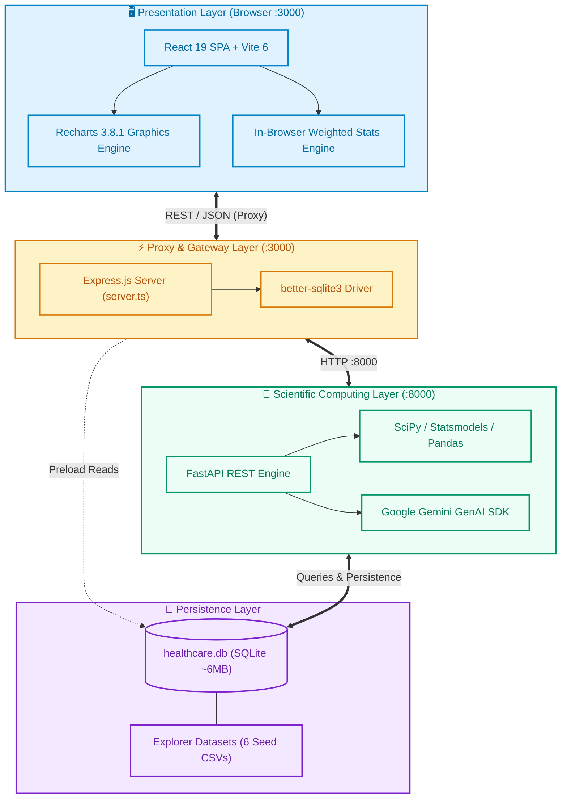
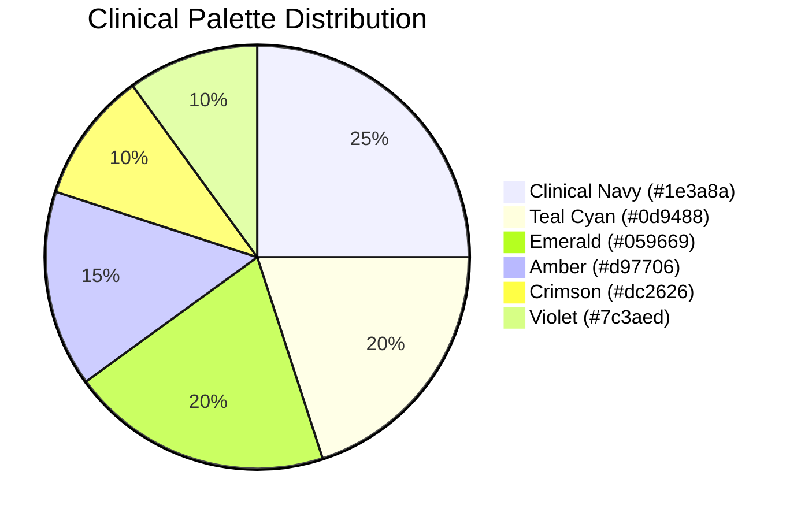
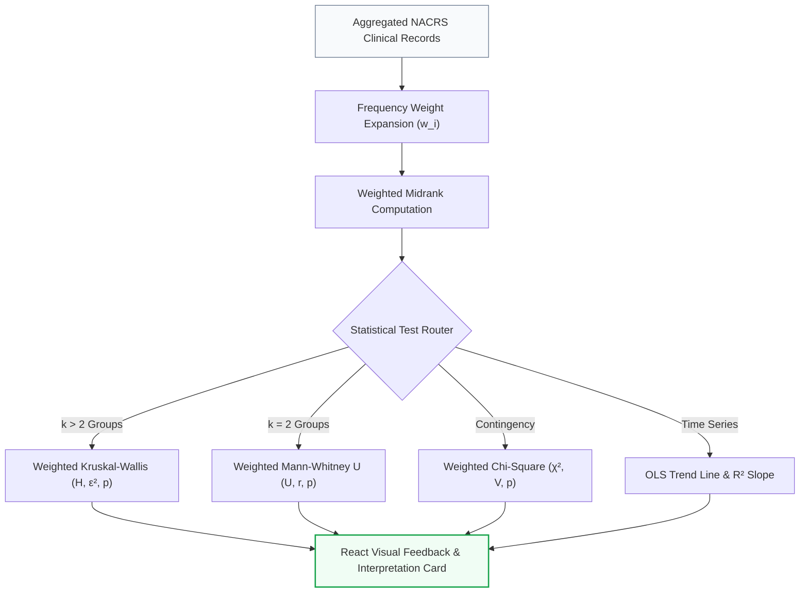
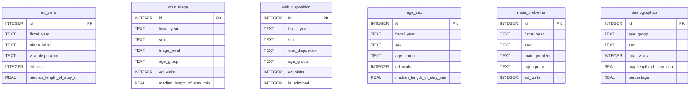

<div align="center">

# 🏥 Healthcare Analytics Platform
### 📊 Interactive Visualization & Intelligence Architecture Guide
**DAMO-6994 Capstone · University of Niagara Falls · Emergency Department Operational Intelligence**

[](https://react.dev/)
[](https://fastapi.tiangolo.com/)
[](https://recharts.org/)
[](https://vitejs.dev/)
[](https://tailwindcss.com/)
[](https://python.org)
[](https://www.sqlite.org/)
[](https://deepmind.google/technologies/gemini/)

<p align="center">
  <b>A comprehensive technical guide to the multi-tier visualization engine — transforming raw clinical NACRS records into sub-millisecond, publication-grade interactive dashboards and statistical inference models.</b>
</p>

---

</div>

## 📑 Table of Contents

```
├── 1.  🏗️ High-Level System Architecture
├── 2.  🚀 Quick Start & Execution Guide
├── 3.  🔄 End-to-End Data Pipeline Flow
├── 4.  🎨 Frontend Technology Ecosystem
├── 5.  ⚙️ Backend & Data Science Engine
├── 6.  📈 The 7-Stage Analytics Pipeline (UI Walkthrough)
├── 7.  🔬 Visualization Libraries & Rendering Engine
├── 8.  📊 Comprehensive Chart Catalog & UI Placement
├── 9.  🧮 Statistical Inference & Mathematical Formulations
├── 10. 🗄️ Database Architecture & Clinical Schemas
├── 11. 📁 Key Source Code & File Mapping
└── 12. ⚡ Quick Reference Matrix
```

---

## 1. 🏗️ High-Level Architecture

The platform is designed around a **decoupled hybrid architecture**: lightning-fast client-side reactive rendering for visual exploration paired with a high-performance Python ASGI backend for scientific computation and AI synthesis.



### Process Coordination Matrix

| Process | Port | Core Technology | Primary Responsibility |
| :--- | :---: | :--- | :--- |
| **Node/Vite Dev Server** | `3000` | TypeScript + Express 4.21 + Vite 6 | Serves optimized React 19 bundle, proxies `/api/*` requests |
| **FastAPI Microservice** | `8000` | Python 3.10+ + Uvicorn + Pydantic v2 | Executes OLS, regression, weighted hypothesis testing & AI generation |
| **Embedded Database** | Local | SQLite 3 (WAL Mode) | Stores pre-seeded clinical data and persisted user datasets |

---

## 2. 🚀 Quick Start & Execution Guide

The entire multi-process environment is orchestrated with a single automated launcher:

```bash
# Clone the repository and boot the ecosystem
python launch.py
```

### What `launch.py` Automates


> [!TIP]
> ### ⚙️ Configurable Environment Variables
> | Variable | Default | Description |
> | :--- | :---: | :--- |
> | `PORT` | `3000` | Overrides the frontend Node/Express server port |
> | `API_PORT` | `8000` | Overrides the Python FastAPI backend port |
> | `NO_BROWSER` | `0` | Set `NO_BROWSER=1` to suppress automatic browser launch (ideal for CI/CD) |

---

## 3. 🔄 End-to-End Data Pipeline Flow

```mermaid
flowchart TD
    A["Raw Clinical CSVs\n(data/Explorer Dataset/)"] -->|backend/database/load_csv.py| B[("SQLite Database\n(healthcare.db)")]
    B -->|GET /api/preload-datasets| C["React Global State\n(rawData[], fields[] in App.tsx)"]
    
    C --> D{"Prep & Quality Engine\n(Stage 2)"}
    D -->|Client-Side Cleaning & Imputation| E["Cleaned In-Memory Dataset\n(cleanedData[])"]
    
    E -->|POST /api/user-datasets/persist| B
    
    E --> F["Executive Dashboard & Visual Explorer\n(Stages 3 & 5)"]
    E --> G["Hypothesis & Statistical Engine\n(Stage 4)"]
    E --> H["GenAI Strategic Insights\n(Stage 6)"]

    F -->|Instant In-Memory Render| I["Recharts 3.8.1 SVG/Canvas Engine\n(0ms latency on filter change)"]
    G -->|POST /api/statistics/*\n(Heavy SciPy/Statsmodels)| J["Statistical Distribution Cards\n& Verification Plots"]
    H -->|POST /api/analyze-dataset\n(@google/genai)| K["Strategic Executive Action Cards\n& KPI Injections"]

    classDef stage fill:#eff6ff,stroke:#3b82f6,stroke-width:2px;
    classDef output fill:#f0fdf4,stroke:#22c55e,stroke-width:2px;
    class D,F,G,H stage;
    class I,J,K output;
```

> [!IMPORTANT]
> ### ⚡ Performance Optimization: Pure Client-Side Reactivity
> **95% of interactive filtering, group-by aggregations, sorting, and chart rendering happens entirely within the browser via React `useMemo` hooks.**
> Filter adjustments do not trigger server round-trips. Python is reserved strictly for heavy non-parametric mathematical operations and LLM synthesis.

---

## 4. 🎨 Frontend Technology Ecosystem

<div align="center">

| Domain | Package | Version | Purpose & Architectural Role |
| :--- | :--- | :---: | :--- |
| **Core Framework** | **React** | `19.0.1` | Component lifecycle, declarative JSX UI, global state management |
| **Build Tooling** | **Vite** | `6.2.0` | Ultra-fast ES-module dev server with Hot Module Replacement (HMR) |
| **Type Safety** | **TypeScript** | `5.8.0` | Strict interface definitions across data contracts and API types |
| **Data Visualization** | **Recharts** | `3.8.1` | Primary chart engine: Line, Bar, Area, Radar, Pie, Composed charts |
| **Styling & Design** | **TailwindCSS** | `4.1.14` | Modern CSS tokens, dark mode palette, fluid layout grids |
| **Iconography** | **Lucide React** | `0.546.0` | Crisp SVG healthcare and operational icons |
| **Micro-Animations** | **Motion** | `12.23.24` | Smooth transitions and layout animations (Framer Motion) |
| **Sheet Processing** | **SheetJS (xlsx)**| `0.20.3` | Client-side ingestion and parsing of uploaded `.xlsx` / `.csv` files |
| **Export Engine** | **html-to-image** | `1.11.13` | DOM-to-PNG rasterization for dashboard report snapshots |
| **Archive Bundler** | **JSZip** | `3.10.1` | Client-side compression of chart figures and cleaned CSV files |
| **GenAI Intelligence** | **@google/genai** | `2.4.0` | Direct Gemini SDK integration for automated analytical narratives |

</div>

---

## 5. ⚙️ Backend & Data Science Engine

<div align="center">

| Layer | Package | Version | Capability |
| :--- | :--- | :---: | :--- |
| **API Engine** | **FastAPI** | `≥ 0.100.0` | High-throughput asynchronous ASGI microservice with OpenAPI Docs |
| **Validation** | **Pydantic** | `≥ 2.0.0` | Strict schema validation for statistical payloads & responses |
| **Data Munging** | **Pandas** | `≥ 2.0.0` | High-performance DataFrame operations, aggregations, and reshaping |
| **Array Math** | **NumPy** | `≥ 1.26.0` | Vectorized matrix calculations powering custom metrics |
| **Inference Stats** | **SciPy** | `≥ 1.11.0` | `scipy.stats` modules: Kruskal-Wallis, Mann-Whitney U, $\chi^2$ tests |
| **Econometrics** | **Statsmodels** | `≥ 0.14.0` | Ordinary Least Squares (OLS) & multivariate regression models |
| **Database** | **better-sqlite3**| `12.11.1` | Synchronous zero-overhead SQLite interface in Node layer |
| **App Server** | **Uvicorn** | `≥ 0.23.0` | High-concurrency ASGI server running the Python core |

</div>

---

## 6. 📈 The 7-Stage Analytics Pipeline (UI Walkthrough)

```mermaid
flowchart LR
    S1["1️⃣ About Project\nContext & Objectives"] --> S2["2️⃣ Prep & Quality\nCleaning & Scoring"]
    S2 --> S3["3️⃣ Dataset Explorer\nEDA & Correlations"]
    S3 --> S4["4️⃣ Hypothesis Tests\nH1–H5 Validation"]
    S4 --> S5["5️⃣ Executive Dashboard\n9-Slot Visual Matrix"]
    S5 --> S6["6️⃣ Strategic Insights\nAI Narrative Engine"]
    S6 --> S7["7️⃣ Reports & Export\nPDF, PNG, ZIP Packs"]

    style S1 fill:#f8fafc,stroke:#94a3b8
    style S2 fill:#e0f2fe,stroke:#0284c7
    style S3 fill:#e0e7ff,stroke:#6366f1
    style S4 fill:#fce7f3,stroke:#db2777
    style S5 fill:#ecfdf5,stroke:#10b981
    style S6 fill:#fef3c7,stroke:#f59e0b
    style S7 fill:#f3e8ff,stroke:#a855f7
```



---

### 1️⃣ Stage 1 — About Project
* **Objective:** Clinical problem formulation, DAMO-6994 capstone framework, research questions, and methodology overview.
* **Key Visuals:** Overview hero card, research hypotheses summary, navigational launch pad.

---

### 2️⃣ Stage 2 — Prep & Quality Engine
* **Objective:** Automated data hygiene, schema normalization, outlier detection, and data completeness scoring.
* **Visual Components:**
  * 🎯 **Data Quality Gauge:** Custom SVG radial arc score ($0-100\%$).
  * 📊 **Quality Breakdown Bar:** Distribution of nulls, duplicates, and type mismatches.
  * 🔄 **Live Data Mutation Table:** Real-time preview of applied imputation rules.

---

### 3️⃣ Stage 3 — Dataset Explorer
* **Objective:** Exploratory Data Analysis (EDA) across clinical variables.
* **Visual Components:**
  * 📉 **Distribution Histograms:** Recharts `BarChart` displaying frequency bins for numeric columns.
  * 🧬 **Correlation Heatmap:** Dynamic CSS Grid mapping Pearson correlation coefficient matrix ($r \in [-1, 1]$).
  * 🏷️ **Categorical Breakdown:** Horizontal bar charts for CTAS triage levels and triage acuity frequencies.

---

### 4️⃣ Stage 4 — Hypothesis Testing & Statistical Analysis
* **Objective:** Rigorous non-parametric statistical evaluation of core DAMO-6994 hypotheses:

| Hypothesis | Clinical Target | Statistical Methodology | Visual Representation |
| :--- | :--- | :--- | :--- |
| **H1** | Triage Acuity vs. Length of Stay | Weighted Kruskal-Wallis Test | `ComposedChart` (Area + Line overlay) |
| **H2** | Sex Differences in ED Throughput | Weighted Mann-Whitney $U$ Test | Dual-density distribution curve |
| **H3** | Age Group Trajectories in LOS | Weighted Kruskal-Wallis Test | Multi-series quantile plot |
| **H4** | Visit Disposition vs. Admission | Frequency-Weighted $\chi^2$ Test | Mosaic contingency bar chart |
| **H5** | Longitudinal Temporal Trends | OLS Linear Regression Trend Slope | Linear fit with confidence intervals |

---

### 5️⃣ Stage 5 — Executive Dashboard *(Flagship)*
* **Objective:** High-level command center with **5 KPI Summary Cards** and **9 Dynamic Visual Slots**.

#### 🎛️ 8 Global Cross-Filters
`Fiscal Year` · `Sex` · `Age Group` · `Population Category` · `CTAS Level` · `Visit Disposition` · `Custom Filter 1` · `Custom Filter 2`

#### 📊 9-Slot Chart Grid

```
┌──────────────────────────────┬──────────────────────────────┬──────────────────────────────┐
│ [Slot 1] 📈 Trend Line      │ [Slot 2] 📊 Triage Bar       │ [Slot 3] 🏛️ Age Column      │
│ Fiscal Year → ED Visits      │ CTAS Level → Median LOS      │ Age Group → ED Visits        │
├──────────────────────────────┼──────────────────────────────┼──────────────────────────────┤
│ [Slot 4] 📋 Disposition Bar  │ [Slot 5] 🌊 LOS Area         │ [Slot 6] 👥 Sex Column       │
│ Disposition → Visit Counts   │ Fiscal Year → LOS Hours      │ Patient Sex → Total Visits   │
├──────────────────────────────┼──────────────────────────────┼──────────────────────────────┤
│ [Slot 7] 📉 Admission Rate   │ [Slot 8] 🩺 Diagnosis Bar    │ [Slot 9] 🔻 Triage Funnel    │
│ Year → % Inpatient Admitted  │ Main Problem → Volume        │ CTAS Acuity Funnel Drop      │
└──────────────────────────────┴──────────────────────────────┴──────────────────────────────┘
```

> [!NOTE]
> Every chart slot contains an interactive control header to toggle between **Line, Bar, Column, Area, and Funnel**, customize X/Y axes, adjust aggregation math (`SUM`, `MEAN`, `MEDIAN`, `COUNT`), and switch color palettes.

---

### 6️⃣ Stage 6 — Strategic Insights (AI Engine)
* **Objective:** Contextual clinical intelligence generated via **Google Gemini GenAI**.
* **Visual Components:**
  * 💡 **Executive Summary Banner:** Natural language synopsis of operational bottlenecks.
  * ⚠️ **Clinical Risk Flags:** Callout cards flagging overcrowding and extreme LOS outliers.
  * 🎯 **Operational Recommendations:** Prioritized action items for ED capacity management.

---

### 7️⃣ Stage 7 — Reports & Export
* **Objective:** Publication-grade artifact compilation and distribution.
* **Export Formats:**
  * 📄 **Cleaned Data Export:** Instant CSV / XLSX client-side file generation.
  * 🖼️ **Chart Snapshots:** High-resolution PNG rasterization via `html-to-image`.
  * 📦 **Executive ZIP Archive:** Bundled package containing all chart PNGs and cleaned datasets via `JSZip`.

---

## 7. 🔬 Visualization Libraries & Rendering Engine

### Recharts Declarative Architecture

```tsx
// Pattern: Responsive Container with Custom K-Formatting Labels
<ResponsiveContainer width="100%" height={320}>
  <ComposedChart data={chartData} margin={{ top: 10, right: 30, left: 0, bottom: 0 }}>
    <CartesianGrid strokeDasharray="3 3" stroke="#e2e8f0" />
    <XAxis dataKey="label" tick={{ fill: '#64748b', fontSize: 12 }} />
    <YAxis tickFormatter={(val) => formatKMB(val)} />
    <Tooltip content={<CustomClinicalTooltip />} />
    <Legend verticalAlign="top" height={36} />
    <Area type="monotone" dataKey="ciUpper" fill="#3b82f6" fillOpacity={0.1} stroke="none" />
    <Line type="monotone" dataKey="value" stroke="#2563eb" strokeWidth={3} dot={<CustomDot />} />
  </ComposedChart>
</ResponsiveContainer>
```

### 🎨 Curated Design System Palettes



* **`clinical`** — Navy (`#1E3A8A`), Teal (`#0D9488`), Emerald (`#059669`), Amber (`#D97706`), Crimson (`#DC2626`), Violet (`#7C3AED`)
* **`powerbi`** — High-contrast PowerBI theme with vibrant yellow, cyan, purple, and royal blue.
* **`tableau`** — Classic Tableau 10 categorical palette for multi-cohort demographic distinction.
* **`emerald`** — Monochromatic green spectrum designed for quality score ratings and operational efficiency metrics.

---

## 8. 📊 Comprehensive Chart Catalog & UI Placement

| Visual Type | Underlying Component | Primary Page / Location | Interactive Controls |
| :--- | :--- | :--- | :--- |
| **Trend Line** | `<LineChart>` + `<Line>` | Executive Dashboard (Slot 1, 7) | Smooth curves, data points, YoY reference line |
| **Acquity Bar** | `<BarChart layout="vertical">` | Executive Dashboard (Slot 2, 4, 8) | Sorting, Top-N limit, custom color coding |
| **Demographic Column** | `<BarChart>` + `<Bar>` | Executive Dashboard (Slot 3, 6) | Grouped / Stacked toggle, custom aggregation |
| **Volume Area** | `<AreaChart>` + `<Area>` | Executive Dashboard (Slot 5) | Gradient fill, boundary opacity |
| **Statistical Composed**| `<ComposedChart>` | Hypothesis Testing (H1–H5) | Area confidence band + Line mean overlay |
| **Polar Radar** | `<RadarChart>` + `<Radar>` | Custom Chart Builder | Metric normalization, angle axes |
| **Donut / Pie** | `<PieChart>` + `<Pie>` | Custom Chart Builder | Inner radius adjust, percentage tooltips |
| **Triage Funnel** | Custom SVG Polygon Grid | Executive Dashboard (Slot 9) | Conversion stages, drop-off % calculations |
| **Correlation Matrix** | Custom CSS Flex Grid | Dataset Explorer | Color scale normalization ($[-1, 1]$) |
| **Quality Gauge** | Custom SVG Path Arc | Prep & Quality Engine | Animated sweep, status-driven color thresholds |

---

## 9. 🧮 Statistical Inference & Mathematical Formulations

Because the NACRS clinical datasets contain aggregated frequency counts rather than individual rows, naive unweighted testing produces severe statistical bias. Our visualization engine incorporates **weighted midrank transformations**:

### Mathematical Models Implemented

```
1. Weighted Midranks:
   R_w(x_i) = ∑_{x_j < x_i} w_j + 0.5 · (1 + w_i)

2. Kruskal-Wallis H-Statistic with Tie Correction:
   H = [ 12 / (N(N + 1)) ] · ∑_{j=1}^k (R_j^2 / n_j) - 3(N + 1)
   H_corrected = H / [ 1 - ∑(t_i^3 - t_i) / (N^3 - N) ]

3. Epsilon-Squared Effect Size:
   ε² = (H - k + 1) / (N - k)

4. Mann-Whitney U Transformation:
   U = R_1 - [ n_1(n_1 + 1) / 2 ]
   Z = (U - m_U) / σ_U
```



---

## 10. 🗄️ Database Architecture & Clinical Schemas

**Physical Location:** `backend/database/healthcare.db` (SQLite 3, ~6 MB pre-populated)



---

## 11. 📁 Key Source Code & File Mapping

```
📦 Capstone_Project-DAMO-6994
├── 🚀 launch.py                         # Universal multi-process orchestrator
├── 📜 package.json                      # Node runtime dependencies & build targets
├── 🐍 requirements.txt                  # Python data science & FastAPI dependencies
├── ⚙️ vite.config.ts                    # Vite bundler, React JSX, & Tailwind plugin setup
├── 🌐 server.ts                         # Express Gateway (Vite server + API Proxy)
│
├── 📂 frontend/src/
│   ├── 📱 App.tsx                       # Root layout, master state, multi-stage navigation
│   ├── ⚡ main.tsx                      # React DOM mounting entry point
│   ├── 📂 components/
│   │   ├── 📂 charts/
│   │   │   └── 🎨 CustomChartBuilder.tsx # Interactive user chart generator (Recharts)
│   │   └── 📂 common/
│   │       └── 📤 DatasetUpload.tsx     # Drag-and-drop file ingestion (SheetJS)
│   ├── 📂 pages/
│   │   ├── 📂 PrepQualityEngine/        # Stage 2: Quality score gauge & cleaning tools
│   │   ├── 📂 DatasetExplorer/          # Stage 3: Dynamic EDA & correlation matrix
│   │   ├── 📂 StatisticalAnalysis/
│   │   │   ├── 🧮 AnalyticsCore.tsx     # Stage 4: In-browser weighted hypothesis math
│   │   │   └── 📊 AnalyticsEngine.tsx   # Stage 4: Composed distribution chart renderer
│   │   ├── 📂 ExecutiveDashboard/
│   │   │   └── 📈 ExecutiveDashboard.tsx# Stage 5: 9-slot responsive visualization grid
│   │   ├── 📂 StrategicInsights/        # Stage 6: Gemini AI synthesis interface
│   │   └── 📂 Reports/                  # Stage 7: PDF / PNG / ZIP report compiler
│   └── 📂 utils/
│       ├── 🏷️ types.ts                  # Global TypeScript contracts
│       ├── 🧠 biEngine.ts               # Semantic field classification
│       └── 🖨️ printToPdf.ts             # Chart DOM rasterizer (html-to-image)
│
├── 📂 backend/
│   ├── 🐍 main.py                       # FastAPI application & CORS configuration
│   ├── 📂 api/
│   │   ├── 📊 statistics.py             # SciPy statistical endpoints (/api/statistics/*)
│   │   ├── 📈 dashboard.py              # Aggregation & KPI endpoints
│   │   ├── 🔍 dataset_explorer_api.py   # Summary statistics & correlation APIs
│   │   └── 🤖 insights.py               # Google Gemini GenAI integration endpoint
│   ├── 📂 analytics/
│   │   ├── 🔬 hypothesis_testing.py     # Python-side H1–H5 hypothesis runners
│   │   ├── 📐 descriptive.py            # Parametric & non-parametric descriptors
│   │   └── 📈 regression.py             # Econometric regression engines (Statsmodels)
│   └── 📂 database/
│       ├── 📄 schema.sql                # SQLite DDL relational table definitions
│       ├── 🌱 load_csv.py               # Seed loader importing CSVs to healthcare.db
│       └── 💾 healthcare.db             # Pre-seeded SQLite database (~6 MB)
│
└── 📂 data/Explorer Dataset/            # Cleaned clinical source data files
    ├── 📑 ED_Visits_Cleaned.csv
    ├── 📑 CTAS_Triage.csv
    ├── 📑 Age_Sex.csv
    ├── 📑 Visit_Disposition.csv
    ├── 📑 Main_Problems.csv
    └── 📑 Demographics_Cleaned.csv
```

---

## 12. ⚡ Quick Reference Matrix

| Feature / Visual | Rendering Technology | Calculation Location | Primary File |
| :--- | :--- | :--- | :--- |
| **Executive Trend Line** | Recharts `<LineChart>` | In-Browser (`useMemo`) | `ExecutiveDashboard.tsx` |
| **CTAS Triage Bar** | Recharts `<BarChart>` | In-Browser (`useMemo`) | `ExecutiveDashboard.tsx` |
| **H1–H5 Hypothesis Curves** | Recharts `<ComposedChart>` | Client-Side (`AnalyticsCore.tsx`) | `AnalyticsEngine.tsx` |
| **Data Quality Gauge** | Custom SVG Radial Arc | Client-Side JS Formula | `PrepQualityEngine.tsx` |
| **Correlation Matrix** | Dynamic CSS Grid | Client-Side Pearson Math | `DatasetExplorer.tsx` |
| **Custom User Charts** | Recharts Multi-Type | Client-Side Dynamic Aggregator | `CustomChartBuilder.tsx` |
| **AI Strategy Cards** | React Tailwind Cards | Gemini API (`@google/genai`) | `StrategicInsights.tsx` |
| **High-Res PNG Export** | `html-to-image` Canvas | Client DOM Rasterizer | `Reports.tsx` |
| **ZIP Report Archive** | `JSZip` Compression | Browser Memory Buffer | `Reports.tsx` |

---

<div align="center">

**Emergency Department Operational Intelligence & Predictive Analytics Platform**  
*Master of Science in Data Analytics · DAMO-6994 Capstone Project · University of Niagara Falls Canada*  
*Lead Author & Architect · August 2026*

</div>
